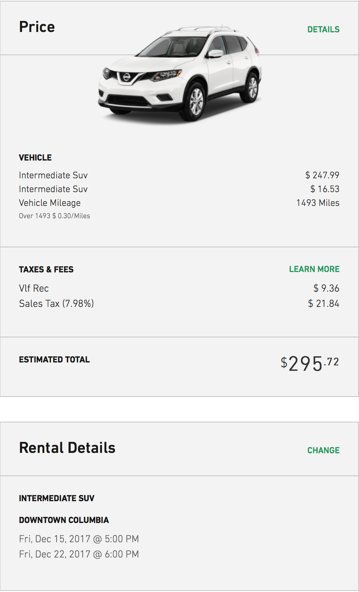

# Trip-Project
**Planning a graduation trip to Brazil for
December 17th-21st with a $30,000 budget**
## Flights   
**December 16:**   
5PM: Pick up Enteprise rental car ($295.72)

  **Total $295.72**

**December 17th**   
12AM: Drive to O'Hare Airport from Columbia ($35.34)
- 7 hour/400 mile drive
- average price of gas in Illinois & Missouri = $2.356
- tank size = 15 gallons
- average mpg = 25mpg
- one tank = 375 miles = $35.34

7AM: Fly from Chicago to Rio de Janeiro ($1,780/person = $8,900 roundtrip)     

  **Total $8,935.34**  

**December 21st**

2AM: Fly from Rio de Janeiro to Chicago     

11PM: Drive to Columbia from O'Hare Airport ($35.34)

 **Total $8,935.34**

 *References:*
Kayak Flights: https://www.kayak.com/flights/CHI-RIO/2017-12-17/2017-12-21/5adults

## Hotel
**Dec 17th - Dec 21th**   
- Name: [Belmond Copacabana Palace](https://www.belmond.com/hotels/south-america/brazil/rio-de-janeiro/belmond-copacabana-palace/)
- Stay is $343 per night per person (5 people), therefore   $1715.00 per night as a group
- This hotel is right on the beach and has alot of popular bars right on the private hotel beach.
- There are multiple restaurants to choose from and each one is special in its own way.   

  **Total $6860.00**
## Food
**Dec 17:**    
- Everyone brings a few snacks for the car ride and plane ride (around $10 a person) = $50

- Stop at Culver's in Springfield on drive to Chicago (around $8 a person) = $40   
- Some meals also provided on the flight (included in the flight cost)  

  **Total: $90**

**Dec 18:**   
Breakfast at [Sofá Café](http://sofacafe.com.br/)
- .1 miles from the hotel
- very good reviews   
- Cost: $5-$15, around $10 a person = $50 total  

Lunch at Sindicato do Arpoador
- Good reviews
- Less touresty restaurant
- Cost: Around $7 a person = $35 total

Dinner at [Alfaia](http://www.restaurantealfaia.com.br/)   
- .2 miles from hotel
- Really good reviews
- Little Pricey: Around $40 a person

  **Total $285**   

**Dec 19th:**    
Eat Breakfast at the Hotel   
- Convienent since we are leaving so early    
- Breakfast Buffet   
- Cost: Around $10 a person = $50   

Lunch at [Restaurante Garota da Urca](http://www.bargarotadeipanema.com.br/)   
- Close to Sugarloaf Mountains   
- Good reviews   
- Scenic Views   
- Cost: Around $8 a person = $40 total

Dinner at [Carretao](http://www.carretaolido.com.br/)
- .2 miles from hotel   
- Good reviews   
- Good portions which will be needed after a hike   
- Cost: Around $20 a person = $100   

  **Total $190**

**Dec 20th:**    
Breakfast at Feel Good   
- .1 miles from the hotel   
- Good Reviews   
- Healthy, Energy packed food for a day jam packed with activities   
- Cost: $5-$15, around $10 a person = $50 total

Lunch at Kitchen and Salads   
- .1 miles from hotel   
- Good reviews   
- Buffet Style Pay by the Weight   
- Brazilian, South American Style Food   
- Cost: Around $10 - $15 a person = $60 total

Dinner at [Amir](http://www.amirrestaurante.com.br/)   
- .2 miles from hotel   
- Really good reviews   
- Good Portions   
- Belly Dancers, Entertainment, Good atmosphere for a fun last night out   
- Middle Eastern Food   
Cost: Around $15 - $20 a person = $90  

  **Total $200**  

**Dec 21st:**

Each Person Brings Snacks $10 a person = $50 total Also snacks provided on the plane (Free)

Breakfast at Panama City Airport
- Convenient
- Everyone can get whatever they would like
- Passes the time during the layover
- Cost: around $10 a person = $50 total

Lunch at Mexico City Airport
- Same reasons as above
- Cost: Around $10 a person = $50 total

Late Dinner stop by Taco Bell on the drive home
- Good Break from driving
- Open Late
- Cheap
- Cost: Around $5 a person = $25

  **Total $175**

## Activities
**Dec 18th:**   
Christ the Redeemer monument
- 14.8 km from hotel, 30 dollar tickets per adult
- reasonable to expect 3 hours total visit time (8:00 AM - 11:00 AM)
- Most recognized man made landmark in Rio.

Arpoador Beach
-  3.6 km from hotel, free
- reasonable to expect 3 hours total visit time (1:00 PM - 4:00 PM)
- A nice beach with some scenic and historic sights nearby

Theatro Municipal do Rio de Janeiro
- 10.3 km from hotel, free to view
- reasonable to expect 2 hours total visit time (7:00 PM - 9:00 PM)
- A famous theater in a busy area.   

  **Total $150**   

**Dec 19th:**   
Sugarloaf Mountains
- 1 hour 44 min avg time to top of mountain
- $18.10 cable car tickets per person
- 6 hours total time, $90.50 for 5 tickets (7:00 AM - 1:00 PM)

Tijuca Rainforest Hiking Tour
- 1.5 hour hike with 2 hours travel time round trip
- 3.5 hours total trip (4:00 PM - 7:30 PM)
- $430 for 5 tickets
- Nice hiking trail through a scenic South American climate.

  **Total $520**

**Dec 20th:**   
Jardim Botanica
- 7.3 km from hotel
- tickets $38 per person, spend $190 on tickets
- likely spend 2.5 hours (9:00 AM - 11:30 AM)
- Highest rated Botanical Garden in Rio.

Maua Square
- 12.3 km from hotel
- likely spend 6 hours total including item 3 (2:00 PM - 8:00 PM)

Museum of Tomorrow in Maua Square
- likely spend 2.5 hours, spend $325 on tickets
- 4:00 PM - 6:30 PM
- Museum that shows a bit of the past, and projects the future.

  **Total $515**

## Transportation
Most efficient option for transportation in Brazil is taking two Ubers throughout the entire trip  

**Dec 17th:**   
- Uber from hotel to airport  
**Total: $18**

**Dec 18th:**
- Uber to Sofá café from hotel roundtrip: $10
- Uber to Christ the Redeemer from hotel roundtrip: $32
- Uber to Arpoador Beach from hotel roundtrip: $14
- Uber to Sindicato do Arpoador from hotel roundtrip: $12
- Uber to Theatro Municipal do Rio de Janeiro from hotel roundtrip: $20
- Uber to  Alfaia from hotel roundtrip: $10

  **Total $98**

**Dec 19th:**   
- Uber to Sugarloaf Mountains from hotel roundtrip: $16
- Uber to Restaurante Garota da Urca from hotel roundtrip: $20
- Taking a shuttle o Tijuca Rainforest Hiking Tour from hotel (Price included in Hiking ticket)
- Uber to Carretao from hotel roundtrip: $20

  **Total $56**  

**Dec 20th:**
- Uber to Feel Good from hotel roundtrip: $10
-  Uber to Jardim Botanica from hotel roundtrip: $28
- Uber to Kitchen and Salads from hotel roundtrip: $10
- Uber to Maua Square from hotel roundtrip: $40
- Uber to Museum of Tomorrow from hotel roundtrip: $18
- Uber to Amir from hotel roundtrip: $10

  **Total $116**   

**Dec 21st:**
- Uber from hotel to Airport
**Total $18**

[Uber Fare Estimator](https://www.uber.com/fare-estimate/)
#  Total Cost:$27,457.40

# Total Budget Used: 91.5%
