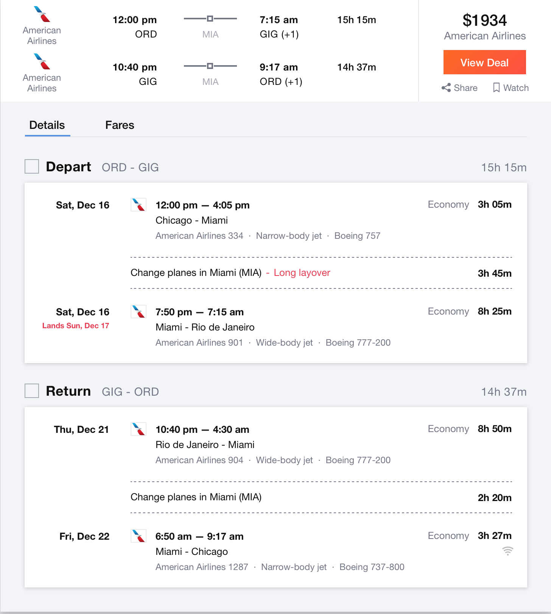

# Flights

### Friday, December 15, 2017
5PM: Pick up Enteprise rental car ($295.72)

### Sunday, December 17, 2017
12AM: Drive to O'Hare Airport from Columbia ($35.34)
* 7 hour/400 mile drive
* average price of gas in Illinois & Missouri = $2.356
* tank size = 15 gallons
* average mpg = 25mpg
* one tank = 375 miles = $35.34

7AM: Fly from Chicago to Rio de Janeiro ($1,780/person = $8,900 total)

### Thursday, December 21, 2017
2AM: Fly from Rio de Janeiro to Chicago ($1,780/person = $8,900 total)
11PM: Drive to Columbia from O'Hare Airport ($35.34)

# Total Cost of Transportation: $18,166.40

*References:*
Kayak Flights: https://www.kayak.com/flights/CHI-RIO/2017-12-17/2017-12-21/5adults

